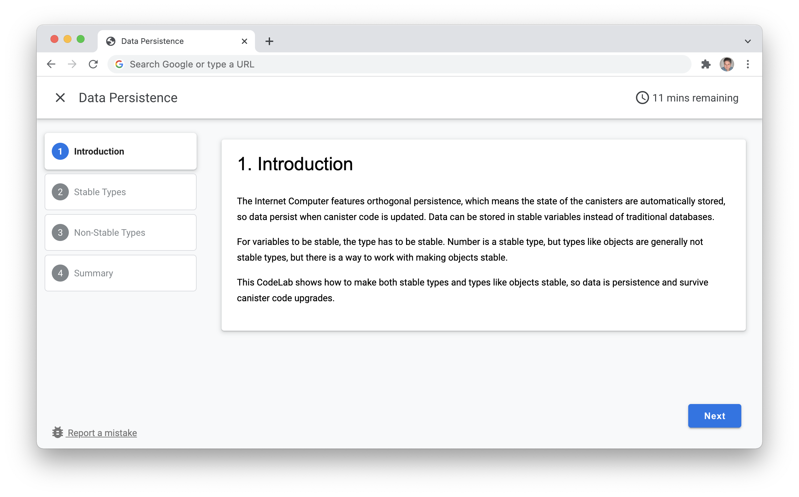

# DFINITY CodeLabs



## How to create a CodeLab
CodeLab is an open source project from Google, and the command line tool `claat` converts Markdown files to user friendly step-by-step guides. See some exambles [here](https://codelabs.developers.google.com).

### Install the tool
The command line tool `claat` (CodeLab as a thing) must be installed first, and there is a good description of how to install the tool in [here](https://github.com/googlecodelabs/tools/tree/main/claat). The tool can either be downloaded as an executable or build it from source.

### Create your first CodeLab
CodeLabs use Markdown, so creating a CodeLab is easy if you are used to creating GitHub README files. The main difference is the header information. 

The Markdown file for a CodeLab must have header like this:
``` 
author: DFINITY
summary: Codelab Example Project
id: minimal_rust_dapp
categories: codelab,markdown
environments: Web
status: Published
feedback link: https://github.com/dfinity/docs
```

The header information is used to configure the CodeLab
- **summary**: Name in the header
- **id**: Folder name of compiled CodeLab
- **feedback link**: URL used in the bug report link in the bottom left corner

**Headline**

At the top level the headline/title must be defined. The headline is defined by using a single #:

```
# Codelab Example
```

**Steps**

The steps in the CodeLab is defined by `##` headings. In the screenshot above, the name in the navigation on the left side, and the heading in the content section in the middle, are defined by the `##` heading. 

The first step in the screenshot looks like this in markdown code:

```
## Introduction
Duration: 0:01:00

The Internet Computer features orthogonal persistence, which means the state of the canisters are automatically stored, so data persist when canister code is updated. Data can be stored in stable variables instead of traditional databases. 
```

**Time remaining**

The time remaining in the CodeLab header is calculated based on the duration specified in each step. By adding this line under the step header, the duration of the step is set to 1 minute and added to the total shown in the CodeLab header:

```
Duration: 0:01:00
```

The duration line in the markup will not be visible in the step content.

**Examples**

See the CodeLabs in [documentation](https://smartcontracts.org/docs/examples/codelabs.html) for learning how to write your own CodeLab, and for inspiration to how to structure the CodeLab content.

## Build the CodeLab
Use the `claat` tool to compile the CodeLab from the markdown file. From the directory where the markdown file is located, run this command:

```sh
$ claat export codelab_name.md
```

A folder will be created with the compiled CodeLab project, containing HTML and images if any are used. The CodeLab is now compiled to a static HTML page.

## Run CodeLabs locally
To run the CodeLabs locally, run this command in the directory generated by the `claat` tool:

```sh
npx http-server
```
or 
```sh
claat serve
```

## Commit your CodeLab
When the CodeLab is created and tested locally, it can be committed to this GitHub repo as a pull request. There are three parts to include. The static Codelab file, images (if images are used) and adding the Codelab to the documentation Codelabs page.
 
### HTML file
The static Codelab HTML file build by the `claat` tool cannot be used directly in the documentation, since the docs' styling and the Codelab's styling don't mix well. To avoid this problem, the HTML is wrapped in an AsciiDoc page stripped for all formatting and styling. This will keep the Codelab's styling and functionality intact, even after compiling the AsciiDoc:

```
:page-layout: empty
++++

<Codelab HTML>

++++
```

Save this file as an AsciiDoc file (.adoc) with an appropiate name. The file must be placed in this folder in the repository: [https://github.com/dfinity/docs/modules/examples/pages/codelabs](https://github.com/dfinity/docs/tree/main/modules/examples/pages/codelabs)
 
### Image file(s)
If images are used in the markdown file, the files will be copied to an image subdirectory the directory created by the `claat` tool, and renamed to ensure a unique filename. Copy these files to this folder [https://github.com/dfinity/docs/modules/examples/assets/images](https://github.com/dfinity/docs/tree/main/modules/examples/assets/images).

Because the files are not in the directory created by the `claat` tool, it is necessary to edit image URLs in the HTML, so images are loaded from the correct location. This is an example with a correct URL:

```html

``` 
 
### Add Codelab to docs
Finally as a last step, the Codelab is added to the Codelabs overview page in the documentation. This step will be changed at some point, but for now the method of adding a Codelab is to add a new object to the `tutorials` array, formattet like this:

```javascript
var tutorials = [
  {
    "id": "",
    "headline": "Data Persistence",
    "body": "The Internet Computer features orthogonal persistence, which means the state of the canisters are automatically stored, so data persist when canister code is updated.",
    "length": "12 minutes",
    "updated": "January 18, 2022",
    "category": "motoko",
    "keywords": [
      "Motoko",
      "Data"
    ],
    "url": baseURL + "/codelabs/data-persistence.html"
  },
  ...
]
```

### Create pull request
Now all three parts have been completed, create a pull request for the Codelab including the AsciiDoc file, images and the added object in the documentation page. The pull request must be added to the [https://github.com/dfinity/docs](https://github.com/dfinity/docs) repository.
