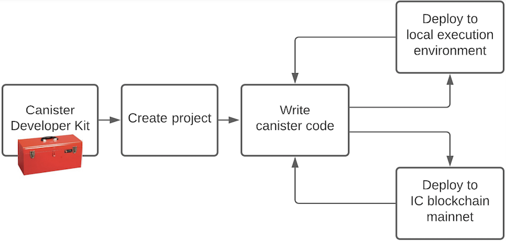

# Project Title
One paragraph of project description goes here. Things to include:
- What is the primary functionality of this project?
- What is the purpose of this project?
- How does it look like in action? Have any screenshots, videos etc.?

## Introduction
This is a high level description of the project. Describe what the project is for, what it is doing and which problem it solves. This should not be long, usually 2-3 lines is good, keep it short and precise.

Highlight some features:
- Consectetur adipiscing elit in efficitur.
- Congue ac nunc nec, bibendum hendrerit mi.
- Donec sodales ligula ac dolor vehicula, at venenatis nulla feugiat.

Duis nisl lacus, dignissim vitae lorem vel, feugiat auctor diam. Aenean elit nunc, porta nec dignissim sit amet, bibendum sed ex. Sed tincidunt erat turpis, at fringilla leo rutrum sed.



Adding an illustration of the architecture can quickly explain how the project is built, and how it works. 

## Installation
Step-by-step guide to get a copy of the project up and running locally for development and testing.

### Prerequisites
Which things you need to install the softwre and how to install them,

```bash
$ install required software and libraries
```

### Install
A step-by-step guide to installing the project, including necessary configuration etc.

```bash
$ git clone <GitHub repo>
$ cd <project>
$ npm install
$ dfx start --background
$ dfx deploy
```

Nullam eu dictum ipsum, eu sagittis lacus. Integer posuere purus vel nisi sodales posuere. Donec dolor libero, posuere ac lacinia vitae, ornare a nisl. Praesent placerat quam non elit blandit, ut pretium lacus rutrum.

## Usage
Mauris et leo sed velit suscipit pulvinar. Etiam molestie velit leo, ac suscipit dolor varius sit amet. Fusce efficitur metus quam, sed gravida quam fringilla ac. Aenean sollicitudin dui in varius vulputate.

### Example 1
Usage examples can be Web-based:

```bash
$ dfx deploy
```

### Example 2
It can be code:

```javascript
const btn = document.getElementById('button');

btn.addEventListener('click', function() {
    alert('Hello World!');
});
```

Praesent facilisis interdum sem ut dignissim. Curabitur rutrum, neque nec faucibus euismod, tellus neque commodo libero, id consectetur massa purus sed lacus. Nunc iaculis sed orci eu fermentum.

## Documentation
Documentation can exist in the README file, but it can also be located elsewhere if it is extensive. 

#### someFunction
```javascript
const token:Token = someFunction(name: string);
```
- **name:string** - a human readable name for the token
- returns **token:Token**

#### anotherFunction
```javascript
anotherFunction(token: Token, value: any);
```
- **token:Token** - a token created via someFunction
- **value:any** - a configuration value
- returns **undefined**

## Testing
Test instructions, and test scripts, for this project:

```bash
$ run test
```

Test specific feature:

```bash
$ run test 1
```

Vestibulum pharetra interdum dolor, ut mollis diam venenatis id. Aenean nunc dolor, facilisis eu elit quis, congue accumsan mi. Phasellus ornare semper orci, ut facilisis odio cursus vel.

## Deployment
Add notes about how to deploy this project to production/public:

1. Nunc at luctus elit
2. Phasellus ornare semper orci
3. Cras gravida aliquet maximus
4. Nunc iaculis sed orci eu 

Fusce efficitur metus quam, sed gravida quam fringilla ac. Aenean sollicitudin dui in varius vulputate. 

```bash
ENV:
    ASDF: 1
    QWE: 123
    ZXC: ert
```

Mauris vel elementum sapien. Nam ipsum tortor, aliquam at nisi et, tincidunt gravida neque. Etiam malesuada, mi et pellentesque rutrum, libero nunc imperdiet nulla, sit amet pellentesque metus nisi ut sapien. Nullam iaculis risus vitae est tincidunt facilisis.

```bash
# First run this command to...
somecmd --qwe=123 asd.qw
# Then run this command...
othercmd qwe asd
```

Maecenas sit amet imperdiet leo. Morbi faucibus viverra enim sit amet elementum.

## License
This project is licensed under the Apache 2.0 license, see LICENSE.md for details. See CONTRIBUTE.md for details about how to contribute to this project. 

## Acknowledgements
- Hat tip to anyone who's code was used
- External contributors
- Etc.

## References
- Quisque ornare
- Etiam dolor ante
- Nullam iaculis risus vitae
